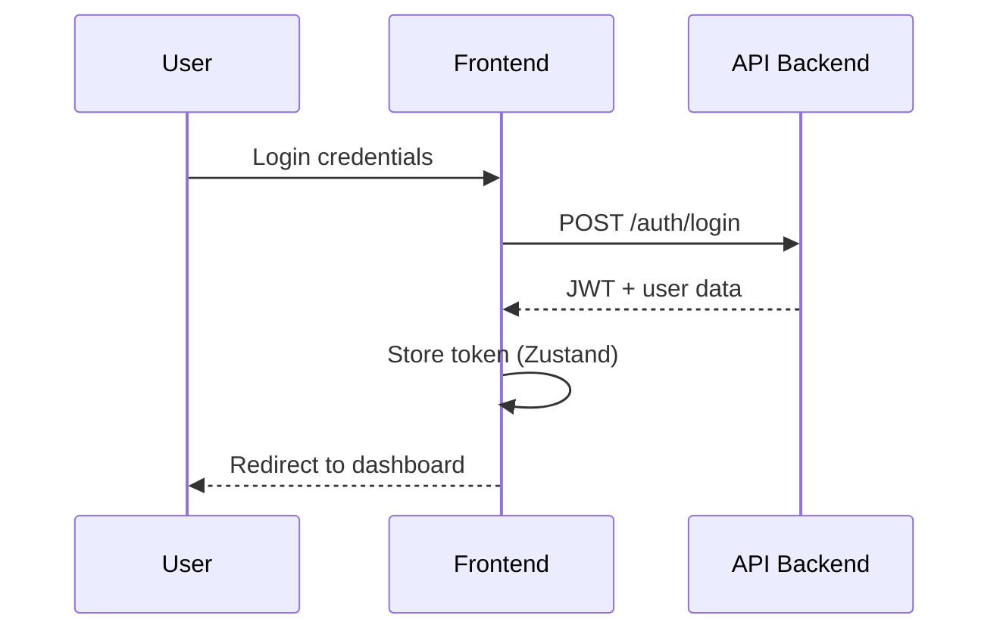
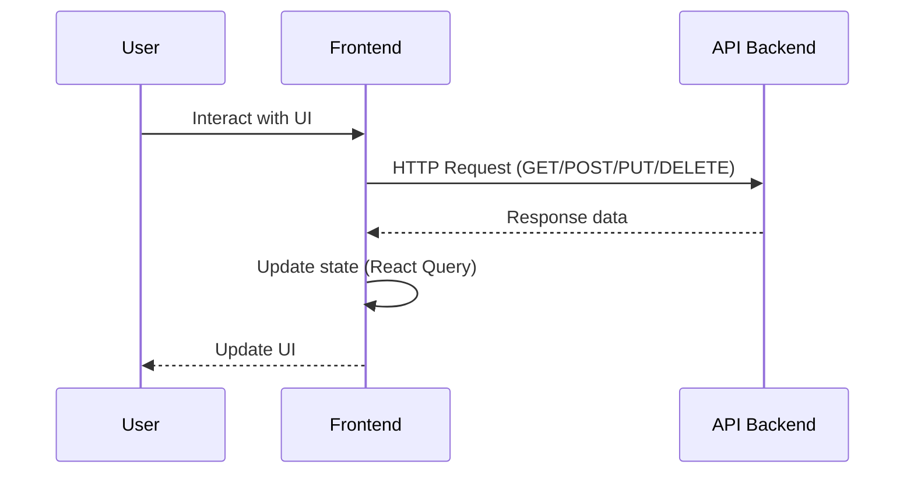

# Arquitectura del Frontend CELHM

## Visión General

Este repositorio contiene únicamente el frontend de CELHM, una aplicación Next.js que se comunica con la API backend a través de HTTP.

## Diagrama de Alto Nivel

```
┌─────────────────┐    ┌─────────────────┐
│   Frontend      │    │   API Backend   │
│   (Next.js)     │◄──►│   (NestJS)      │
│                 │    │                 │
│ - React 18      │    │ - REST API      │
│ - App Router    │    │ - PostgreSQL    │
│ - TypeScript    │    │ - Prisma ORM    │
│ - Tailwind CSS  │    │                 │
└─────────────────┘    └─────────────────┘
```

**Nota:** La API backend está en un repositorio separado: `celhm-api-main`

## Stack Tecnológico

### Frontend
- **Framework**: Next.js 14 (App Router)
- **UI**: React 18, Tailwind CSS, Radix UI
- **Estado**: Zustand
- **HTTP Client**: Axios
- **Testing**: Jest, Playwright
- **TypeScript**: 5.3+

### Packages Compartidos
- **`@celhm/types`**: Tipos TypeScript compartidos
- **`@celhm/ui`**: Componentes UI compartidos
- **`@celhm/config`**: Configuraciones compartidas (ESLint, TypeScript, Prettier)

## Estructura del Proyecto

```
celhm-app-main/
├── src/                  # Código fuente de la aplicación
│   ├── app/              # Páginas y layouts (App Router)
│   ├── components/       # Componentes React
│   ├── lib/              # Utilidades y hooks
│   └── stores/           # Estado global (Zustand)
├── packages/
│   ├── types/            # Tipos TypeScript compartidos
│   ├── ui/               # Componentes UI compartidos
│   └── config/           # Configuraciones compartidas
├── tests/
│   └── e2e/              # Tests E2E con Playwright
└── ...
```

## Flujos de Datos Principales

### 1. Autenticación



### 2. Gestión de Datos



## Comunicación con la API

### Configuración

La URL de la API se configura mediante la variable de entorno:

```env
NEXT_PUBLIC_API_URL=http://localhost:3001
```

### Cliente HTTP

Se usa Axios con interceptores para:
- Agregar token JWT a las peticiones
- Manejar errores de forma centralizada
- Normalizar respuestas

```typescript
// src/lib/api.ts
import axios from 'axios';

const api = axios.create({
  baseURL: process.env.NEXT_PUBLIC_API_URL,
});

// Interceptor para agregar token
api.interceptors.request.use((config) => {
  const token = useAuthStore.getState().token;
  if (token) {
    config.headers.Authorization = `Bearer ${token}`;
  }
  return config;
});
```

## Estado Global

### Zustand Stores

- **`auth.ts`**: Estado de autenticación (token, usuario, login/logout)

### React Query

- **`useTickets`**: Gestión de tickets
- **`useCatalog`**: Gestión de catálogo
- **`useStock`**: Gestión de inventario
- **`useMovements`**: Movimientos de inventario

## Testing

### Tests Unitarios
- **Jest**: Para componentes y utilidades
- **Testing Library**: Para testing de componentes React

### Tests E2E
- **Playwright**: Para tests end-to-end

## Build y Deploy

### Desarrollo Local
```bash
pnpm dev
```

### Build de Producción
```bash
pnpm build
```

### Deploy
El proyecto está configurado para deploy en Vercel. Ver `vercel.json` para detalles.

## Notas Importantes

- Este repositorio **NO** contiene código de backend
- La API backend está en `celhm-api-main`
- Los tipos TypeScript se comparten a través de `@celhm/types`
- La comunicación con la API es únicamente mediante HTTP REST
