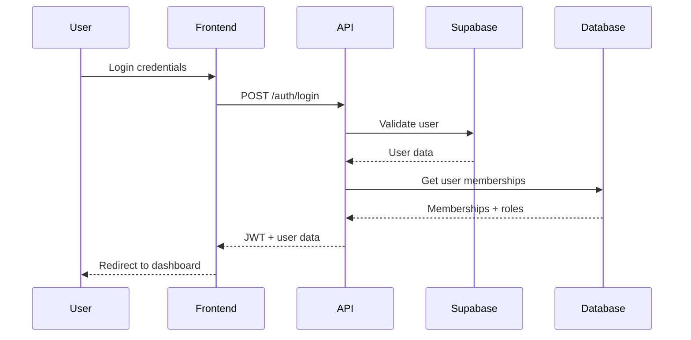
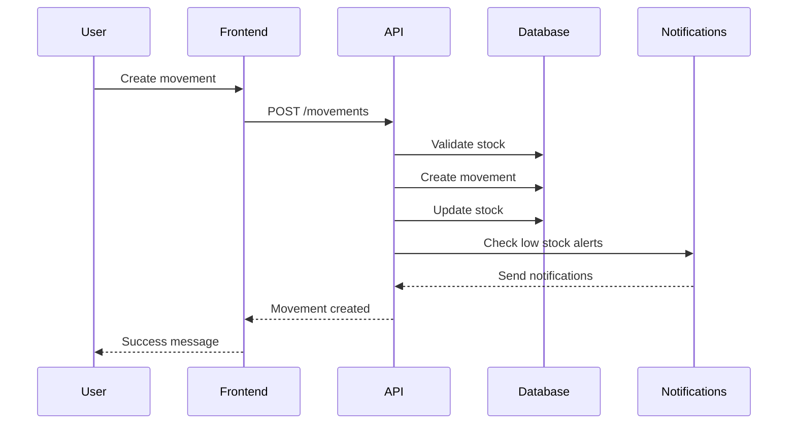
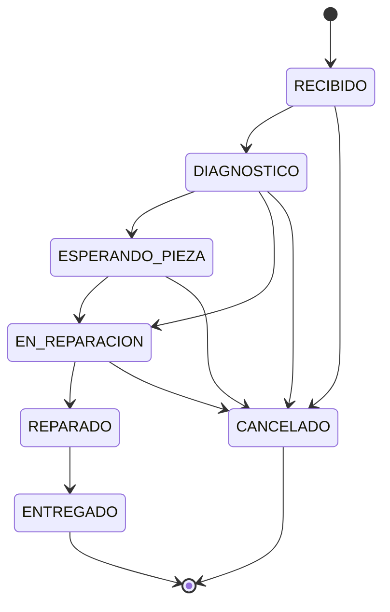

# Arquitectura del Sistema CELHM

## Visión General

CELHM es un sistema SaaS multi-tenant para gestión de inventarios y tickets de reparación, diseñado con una arquitectura moderna y escalable.

## Diagrama de Alto Nivel

```
┌─────────────────┐    ┌─────────────────┐    ┌─────────────────┐
│   Frontend      │    │   API Gateway   │    │   Database      │
│   (Next.js)     │◄──►│   (NestJS)      │◄──►│   (PostgreSQL)  │
│                 │    │                 │    │                 │
│ - React 18      │    │ - REST API      │    │ - Supabase      │
│ - App Router    │    │ - GraphQL       │    │ - Prisma ORM    │
│ - TypeScript    │    │ - Swagger       │    │ - Multi-tenant  │
│ - Tailwind CSS  │    │ - Auth          │    │                 │
└─────────────────┘    └─────────────────┘    └─────────────────┘
         │                       │                       │
         │                       │                       │
         ▼                       ▼                       ▼
┌─────────────────┐    ┌─────────────────┐    ┌─────────────────┐
│   External      │    │   Background    │    │   File Storage  │
│   Services      │    │   Jobs          │    │                 │
│                 │    │                 │    │                 │
│ - Resend        │    │ - BullMQ        │    │ - Vercel Blob   │
│ - Twilio        │    │ - Redis         │    │ - Local Storage │
│ - Meta Cloud    │    │ - Cron Jobs     │    │                 │
└─────────────────┘    └─────────────────┘    └─────────────────┘
```

## Arquitectura Multi-tenant

### Estrategia de Tenancy

Utilizamos **Shared Database, Shared Schema** con discriminación por `organizationId`:

```sql
-- Todas las tablas incluyen organizationId
CREATE TABLE tickets (
  id SERIAL PRIMARY KEY,
  organization_id INTEGER NOT NULL,
  branch_id INTEGER NOT NULL,
  folio VARCHAR(50) NOT NULL,
  -- ... otros campos
  FOREIGN KEY (organization_id) REFERENCES organizations(id)
);
```

### Ventajas de esta Estrategia

- ✅ **Costo eficiente**: Una sola base de datos
- ✅ **Mantenimiento simple**: Un schema para todos
- ✅ **Escalabilidad**: Fácil agregar nuevos tenants
- ✅ **Backup/Recovery**: Proceso unificado

### Desventajas y Mitigaciones

- ⚠️ **Aislamiento de datos**: Mitigado con validación estricta
- ⚠️ **Escalabilidad horizontal**: Limitada, pero suficiente para MVP
- ⚠️ **Customización por tenant**: Limitada, pero extensible

## Flujos de Datos Principales

### 1. Autenticación y Autorización



### 2. Gestión de Inventario



### 3. Workflow de Tickets



## Componentes del Sistema

### Frontend (Next.js)

#### Estructura de Carpetas
```
apps/web/src/
├── app/                 # App Router pages
│   ├── dashboard/       # Dashboard pages
│   ├── login/          # Auth pages
│   └── layout.tsx      # Root layout
├── components/         # Reusable components
├── hooks/              # Custom React hooks
├── lib/                # Utilities and API client
├── stores/             # Zustand stores
└── types/              # TypeScript types
```

#### Patrones de Estado

- **Zustand**: Estado global (auth, UI)
- **React Query**: Cache de datos del servidor
- **React Hook Form**: Formularios con validación
- **Local State**: Estado de componentes

### Backend (NestJS)

#### Arquitectura Modular

```
apps/api/src/
├── auth/               # Authentication module
├── rbac/               # Role-based access control
├── org/                # Organization management
├── branches/           # Branch management
├── catalog/            # Product catalog
├── stock/              # Inventory management
├── movements/          # Stock movements
├── folios/             # Folio generation
├── tickets/            # Ticket management
├── notifications/      # Notification system
├── health/             # Health checks
└── common/             # Shared utilities
    ├── decorators/     # Custom decorators
    ├── guards/         # Auth guards
    ├── interceptors/   # Request/response interceptors
    └── pipes/          # Validation pipes
```

#### Patrones de Diseño

- **Module Pattern**: Separación por dominio
- **Repository Pattern**: Abstracción de datos con Prisma
- **Strategy Pattern**: Proveedores de notificaciones
- **Observer Pattern**: Eventos de auditoría
- **Factory Pattern**: Generación de folios

### Base de Datos (PostgreSQL + Prisma)

#### Schema Multi-tenant

```prisma
model Organization {
  id        Int       @id @default(autoincrement())
  name      String
  slug      String    @unique
  users     OrgMembership[]
  branches  Branch[]
  // ... otros campos
}

model Branch {
  id             Int       @id @default(autoincrement())
  organizationId Int
  organization   Organization @relation(fields: [organizationId], references: [id])
  // ... otros campos
  @@unique([organizationId, code])
}
```

#### Índices y Optimizaciones

```sql
-- Índices para consultas frecuentes
CREATE INDEX idx_tickets_organization_branch ON tickets(organization_id, branch_id);
CREATE INDEX idx_stock_branch_variant ON stock(branch_id, variant_id);
CREATE INDEX idx_movements_created_at ON movements(created_at DESC);

-- Índices únicos para integridad
CREATE UNIQUE INDEX idx_folio_sequences_unique ON folio_sequences(prefix, branch_id, period);
```

## Seguridad

### Autenticación

- **Supabase Auth**: JWT tokens con refresh
- **Magic Links**: Login sin contraseña
- **Social Auth**: Google, GitHub (futuro)

### Autorización

- **RBAC**: Roles granulares por organización
- **Guards**: Protección de endpoints
- **Decorators**: `@Roles()`, `@CurrentUser()`

### Validación

- **Zod**: Validación de esquemas
- **class-validator**: DTOs del backend
- **Sanitización**: Limpieza de entrada

### Rate Limiting

```typescript
@Throttle({ short: { limit: 5, ttl: 60000 } }) // 5 intentos por minuto
@Post('login')
async login(@Body() loginDto: LoginDto) {
  // ...
}
```

## Notificaciones

### Arquitectura de Proveedores

```typescript
interface NotificationProvider {
  send(recipient: string, message: string): Promise<NotificationResult>;
}

class EmailProvider implements NotificationProvider {
  // Implementación con Resend
}

class SmsProvider implements NotificationProvider {
  // Implementación con Twilio
}

class WhatsappProvider implements NotificationProvider {
  // Implementación con Meta Cloud API
}
```

### Sistema de Plantillas

- **MDX**: Markdown con variables
- **Variables dinámicas**: `{{customerName}}`, `{{folio}}`
- **Condicionales**: `{{#if condition}}...{{/if}}`
- **Localización**: Soporte para múltiples idiomas

## Escalabilidad

### Horizontal Scaling

- **Stateless API**: Sin estado en el servidor
- **Load Balancer**: Distribución de carga
- **Database Sharding**: Por organización (futuro)
- **CDN**: Assets estáticos

### Vertical Scaling

- **Connection Pooling**: Prisma con pool de conexiones
- **Caching**: Redis para sesiones y cache
- **Background Jobs**: BullMQ para tareas pesadas
- **Database Optimization**: Índices y consultas optimizadas

## Monitoreo y Observabilidad

### Logging

- **Structured Logging**: JSON logs
- **Log Levels**: ERROR, WARN, INFO, DEBUG
- **Correlation IDs**: Trazabilidad de requests
- **Audit Trail**: Operaciones sensibles

### Métricas

- **Health Checks**: `/health` endpoint
- **Performance**: Response times, throughput
- **Business**: Tickets creados, stock bajo
- **Errors**: Rate de errores, tipos

### Alertas

- **Stock Bajo**: Notificaciones automáticas
- **Errores Críticos**: Slack/Email alerts
- **Performance**: Degradación de servicio
- **Security**: Intentos de acceso sospechosos

## Deployment

### Vercel (Recomendado)

- **Serverless**: Escalado automático
- **Edge Functions**: Baja latencia
- **Preview Deploys**: Testing automático
- **Analytics**: Métricas de uso

### Docker (Alternativo)

- **Multi-stage builds**: Imágenes optimizadas
- **Health checks**: Verificación de estado
- **Secrets**: Variables de entorno seguras
- **Orchestration**: Docker Compose/Kubernetes

## Consideraciones Futuras

### Mejoras de Arquitectura

1. **Microservicios**: Separar por dominio
2. **Event Sourcing**: Historial completo de cambios
3. **CQRS**: Separación de comandos y consultas
4. **GraphQL**: API más flexible
5. **Real-time**: WebSockets para updates en vivo

### Integraciones

1. **ERP Systems**: SAP, Oracle
2. **Payment Gateways**: Stripe, PayPal
3. **Shipping**: FedEx, UPS APIs
4. **Analytics**: Google Analytics, Mixpanel
5. **Monitoring**: DataDog, New Relic

### Performance

1. **Caching**: Redis, Memcached
2. **CDN**: CloudFlare, AWS CloudFront
3. **Database**: Read replicas, sharding
4. **Search**: Elasticsearch, Algolia
5. **Queue**: RabbitMQ, Apache Kafka

---

Esta arquitectura está diseñada para ser **escalable**, **mantenible** y **segura**, con la flexibilidad necesaria para crecer con las necesidades del negocio.

